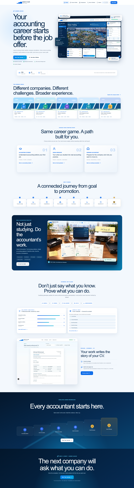

# التقرير الشامل لمشروع Debit & Credit

| البند | الحالة عند المراجعة |
| --- | --- |
| آخر مراجعة | 18 سبتمبر 2026 |
| المنتج وعالمه | Debit & Credit — by Money Coder؛ Mizan Trading |
| المستودع | [AhmedMohamed500/Debit-Credit](https://github.com/AhmedMohamed500/Debit-Credit) |
| فرع التطوير | `codex/career-league` |
| آخر commit وظيفي تمت مراجعته | `77c7408c7bd30b4f68a5b7b2e0ae71cb00fddf2a` |
| PR الحالي | [#4 — Career League](https://github.com/AhmedMohamed500/Debit-Credit/pull/4) — مفتوح و`CLEAN`، وفحص Vercel للـcommit الوظيفي ناجح |

هذا الملف هو نقطة الدخول الواحدة لفهم **ما نُفّذ فعلاً**، وكيف تبدو التجربة، وما بقي محاكاة محلية أو خطة مستقبلية. تقارير المراحل التفصيلية وروابط الصور في آخر الملف. الأرقام القديمة للاختبارات والجوائز داخل التقارير التاريخية تصف لحظة صدورها؛ مرجع الحالة الحالية هو الكود ونتيجة التحقق في هذا التقرير.

## المحتويات

1. [المنتج وحدوده](#1-المنتج-وحدوده)
2. [تاريخ التطوير](#2-تاريخ-التطوير)
3. [رحلة اللاعب الحالية](#3-رحلة-اللاعب-الحالية)
4. [المحاسبة وFirst Shift](#4-المحاسبة-وfirst-shift)
5. [طبيعة الحسابات](#5-طبيعة-الحسابات)
6. [الأدلة المهنية وCareer Profile](#6-الأدلة-المهنية-وcareer-profile)
7. [Academy وGame Hub](#7-academy-وgame-hub)
8. [Career League](#8-career-league)
9. [اللاندينج والهوية البصرية](#9-اللاندينج-والهوية-البصرية)
10. [التقنية والتخزين](#10-التقنية-والتخزين)
11. [المسارات الرئيسية](#11-المسارات-الرئيسية)
12. [الجودة والنشر](#12-الجودة-والنشر)
13. [ما لم يُنفّذ بعد](#13-ما-لم-ينفّذ-بعد)
14. [دليل الملفات والتقارير](#14-دليل-الملفات-والتقارير)

## 1. المنتج وحدوده

**Debit & Credit لعبة مسار مهني محاسبي مبنية على محاكاة شغل الشركات.** يبدأ اللاعب كمحاسب داخل Mizan Trading، يستلم مستندات وطلبات من المدير المالي أ/ كريم، يفحص الأدلة، يختار إجراءً مهنيًا، يسجل القيد عندما يكون مؤيدًا، ويرى أثر قراره على دفاتر الشركة. الأداء المؤهل ينتقل إلى Skill Passport وCareer Profile وAuto CV.

```text
موقف عمل → مستندات وتحقيق → قرار مهني → قيد محمي → أثر على الشركة
         → أحداث أداء → دليل مهارة → فجوة وظيفية → CV ومسار ترقٍّ
```

المنتج **Frontend-only** في الحالة الحالية: Next.js مع حفظ المتصفح المحلي. الشركات والوظائف والمنافسون المعروضون داخل Career League أمثلة/محاكاة خيالية، وليست جهات توظيف حقيقية. لا يوجد Backend للحسابات، أو حسابات مستخدمين، أو مزامنة بين الأجهزة، أو توثيق مستقل للمهارات. لا يحوّل اللعب المحلي أي مهارة إلى `Verified`.

**قاعدة الصدق الأساسية:** XP وCoins والمستوى والدوري عناصر لعبة؛ لا تُعد دليلاً على كفاءة مهنية ولا تُستخدم في CV أو جاهزية الدور. خبرة المستخدم الحقيقية تبقى منفصلة عن محاكاة Mizan Trading.

## 2. تاريخ التطوير

| الفترة | ما حدث | مراجع التنفيذ |
| --- | --- | --- |
| 5 سبتمبر | فصل منتج التعليم المحاسبي عن FINORA مع ترحيل تعليمي محدود؛ بقيت بيانات ERP التشغيلية خارج المشروع. | `f1516a9`, [تقرير الفصل](MIGRATION_FROM_FINORA.md) |
| 6–7 سبتمبر | توحيد رحلة اللعبة، بناء عالم الطالب، حملة Mizan Trading، والمقدمة السينمائية لـFirst Day. | `23dbc8d`, `7308402`, `0225188`, `244b3c5` |
| 7–8 سبتمبر | تحويل أول وردية إلى مكتب Point-and-Click ومستندات محاسبية قابلة للعب. | `8df295c`, `fd83195`, `6351c10` |
| 8–9 سبتمبر | إعادة تصميم طبيعة الحسابات ككتاب داخل عالم اللعبة، توسيعها إلى 197 حسابًا، وإصلاح laptop/tablet/mobile. | `55dc688`, `50437ea`, `4260e5e` |
| 10 سبتمبر | تأسيس Career Profile وSkill Passport وAuto CV مع فصل واضح بين المحاكاة والعمل الحقيقي. | `d48cd2e` |
| 11–12 سبتمبر | Gameplay Phase B: حالات محاسبية قابلة لإعادة الاستخدام، أحداث ومحاولات، أداء مهني، أدلة، ثم معايرة Risk Awareness وPracticed/Demonstrated. | `43bc76f`, `751ecc0`, `1f69465`, `74b6bcc` |
| 12–13 سبتمبر | منصة Academy وGame Hub والتيمات والمنافسة التجريبية، ثم تعديل مركز اللعب إلى عالم شركة Mizan المصوّر والتفاعلي. | `3e0883b`, `05eb612`, `46b518b`, `8311d96`, `febd04b` |
| 14 سبتمبر | أساس Career League: شخصيات البداية، سلم الشركات، فجوة المهارات، الوظائف الخيالية، التأهيل، الترقية، وCorporate Bridge المحدود. | `6dcdb89`, `0d5fa0e`, `1d7d167` |
| 15 سبتمبر | اللاندينج المهنية الجديدة: صور فعلية للعبة وFirst Shift وCV، عالم الشركات، رحلة الثماني خطوات، ودعم الهاتف واللغتين. | `c10339c`, `77c7408` |

التطوير متسلسل عبر أربع مراجعات مفتوحة: [PR #1](https://github.com/AhmedMohamed500/Debit-Credit/pull/1) من `main` إلى First Day، ثم [PR #2](https://github.com/AhmedMohamed500/Debit-Credit/pull/2) إلى Gameplay Phase B، ثم [PR #3](https://github.com/AhmedMohamed500/Debit-Credit/pull/3) إلى Academy/Game Hub، ثم [PR #4](https://github.com/AhmedMohamed500/Debit-Credit/pull/4) إلى Career League. **لم يُدمج أي منها تلقائيًا في `main` وقت هذه المراجعة.**

## 3. رحلة اللاعب الحالية

| المرحلة | تجربة اللاعب | الحالة |
| --- | --- | --- |
| اللاندينج | يفهم أن المنتج محاكاة مسار محاسبي، ويرى صور اللعب وCV ويختار نقطة البداية. | منفّذة |
| Onboarding | يختار طالب/خريج/محاسب يعمل، والهدف والبيئة المناسبة؛ الاختيار وحده لا يمنح مهارة. | منفّذة محليًا |
| Game Hub | يدخل شركة Mizan المصوّرة، يتنقل بين الأقسام ويرى الوارد وتقدم First Shift وأثر الشركة. | منفّذ |
| Academy | ينتقل عبر أساسيات المحاسبة والتدريب والمحاكاة والتحديات. | أساس منفّذ؛ مراحل الإقفال مقفولة |
| First Shift | يفحص ثلاث حالات، يختار تصرفًا مهنيًا، ثم يبني القيد ويشاهد أثره. | قابل للعب |
| Skill Passport | يرى ما مارسه أو أثبته، ومصدر الحالة والمحاولات والمساعدة والأدلة المفحوصة. | منفّذ محليًا |
| Career League | يحدد وظيفة مستهدفة، يشاهد الفجوة وخطة التدريب وسلّم الشركات وشروط الترقية. | أساس وvertical slice؛ بعض المسارات مخططة أو مقفولة |
| Auto CV | يولّد عرضًا مهنيًا من بياناته وأدلته، مع طباعة/حفظ PDF من المتصفح وتصدير JSON. | منفّذ محليًا |
| Employer/Leaderboard | يرى عرضًا تجريبيًا بمرشحين ومنافسين محددين مسبقًا. | **Demo**؛ لا أصحاب عمل أو لاعبين أونلاين |

توجد أيضًا أنظمة تاريخية ما زالت في المستودع مثل Missions وMoney Flow وAccounting Detective وArena وJournal/Ledger/Trial Balance. دمجها مع الرحلة الجديدة متفاوت؛ وجود مسار أو بيانات لا يعني أن كل محتوى Career League اللاحق قابل للعب.

## 4. المحاسبة وFirst Shift

### العمل داخل Mizan Trading

تجربة Chapter 1 تعرض أ/ كريم، مكتبًا محاسبيًا، Laptop يعمل كنظام Mizan OS، الوارد، المستندات، اليومية، أرصدة الشركة وProcessed Tray. حلقة الحالة الحالية هي:

```text
استلام الملف → فتح المستند الأصلي والمستندات المؤيدة → التحقيق
→ اختيار Post أو Hold أو Request Information عند ملاءمته
→ بناء القيد → التحقق المحاسبي → نتيجة على دفاتر الشركة → العودة للمكتب
```

| الحالة | أهم الأدلة | القيد المقبول |
| --- | --- | --- |
| Supplier Invoice `INV-1048` | أمر شراء `PO-771` وإذن استلام `GRN-771` | Dr Office Equipment / Cr Accounts Payable — EGP 100,000 |
| Customer Receipt `REC-4587` | إشعار بنك `BA-312` وفاتورة مبيعات `SI-2041` | Dr Bank / Cr Accounts Receivable — EGP 75,000 |
| Office Expense `PV-2201` | سند نقدية ومذكرة سياسة المصروفات | Dr Office Supplies Expense / Cr Cash — EGP 2,500 |

**ضمانات المحاسبة:** القيد المقبول يمر عبر محرك التحقق الحالي. تساوي المدين والدائن وحده لا يكفي؛ الحسابان والمعنى يجب أن يطابقا الحالة. المحاولة الخاطئة لا تعدّل اليومية المقبولة أو الأرصدة. الترحيل غير المؤيد يُمنع، وإعادة الإرسال لا تكرر القيد أو الأثر أو المكافأة. الأرصدة وعدّادات Pending والدرج المعالج مشتقة من الحالة المقبولة، لا من عناصر واجهة زخرفية.

### Gameplay Phase B

`lib/cases/` يضم تعريف الحالة، runtime، المحرك، المستودع، تقييم الأداء والعواقب. سجل الأحداث `GameState.casework.events` تزايدي ومُرقّم بالإصدار، مع معرفات ثابتة تمنع التكرار. تشمل الأحداث فتح الحالة، فحص المستندات، القرار، إرسال القيد، طلب مساعدة المدير، الترحيل المقبول، النتيجة، وإكمال الوردية. تسمح البنية بربط حالات وعواقب مؤجلة مستقبلًا، لكن First Shift لا تختلق خطأ مؤجلًا لم يحدث.

الأداء المهني حتمي ويقيس: **Accuracy 30%، Accounting Judgment 25%، Investigation 20%، Documentation 10%، Risk Awareness 10%، Independence 5%**. فحص الأدلة قبل الترحيل والتصرف الوقائي المناسب يدعمان Risk Awareness؛ محاولة Post مبكرة أو غير مؤيدة تخصم ولا تكافئ اللاعب، وتكرارها لا يرفع الدرجة. نتيجة الوردية ورد المدير مشتقان من أحداث اللعب نفسها.

> **حد الفصل:** Chapter 2 / Closing Week موجود كتعريف معماري مقفول وغير قابل للعب؛ لا يوجد إعلان بأنه اكتمل.

## 5. طبيعة الحسابات

دليل [طبيعة الحسابات](NATURE-OF-ACCOUNTS.md) مرجع محاسبي داخل اللعبة وعلى الويب، وليس مجرد صورة. يعرض كتابًا مفتوحًا على مكتب Mizan مع صفحات HTML تفاعلية، بحث بالكود والاسم، ست فئات، طبيعة الحساب، جهة الزيادة والنقص، موضعه في القوائم، المستندات المؤيدة، مسار الدورة المستندية، ومثال القيد.

| الفئة | الحسابات | الطبيعة العامة |
| --- | ---: | --- |
| الأصول | 62 | مدينة |
| الالتزامات | 40 | دائنة |
| حقوق الملكية | 10 | دائنة |
| الإيرادات | 23 | دائنة |
| المصروفات والتكاليف | 54 | مدينة |
| الحسابات المقابلة | 8 | بحسب الحساب الأصلي |
| **الإجمالي** | **197** | — |

يظهر المرجع في الشريط العلوي، وفي First Day وFirst Shift وأثناء بناء القيد. فتحه من اللعبة يبقي مسودة القيد الأصلية محفوظة. يوجد تنزيل مباشر في `/docs/nature-of-accounts.md`. الملف الداخلي ومصدر البيانات والمسار وCSS الأساسي محميون باختبار fingerprint لمنع التغيير العرضي. التفاصيل في [تقرير طبيعة الحسابات](NATURE-OF-ACCOUNTS-REPORT.md).

## 6. الأدلة المهنية وCareer Profile

### سجل مهارات قابل للتفسير

يوجد **19 مهارة** و**9 أدوار محاسبية مستهدفة**. حالات المهارة هي:

```text
Unassessed → Practiced → Demonstrated → Verified
```

`Verified` يتطلب مصدر تقييم موثوقًا مستقبليًا ولا ينتج من اللعب المحلي. First Shift حالة تمهيدية: حالة ناجحة واحدة أو اثنتان تبقيان عادةً `Practiced`. الانتقال إلى `Demonstrated` يتطلب ثلاث حالات تمهيدية مختلفة ومؤهلة للمهارة نفسها، مع صحة من أول محاولة، مساعدة محدودة، وتحقيق وحكم محاسبي كافيين. الأدلة التاريخية تبقى مقروءة ولا تُخفض تدميريًا عند إعادة الحساب.

تفسير كل مهارة يعرض الحالة المصدرية، المحاولات، مساعدة أ/ كريم، الأدلة المفحوصة، الأداء، وسبب التصنيف. لا تُعرض XP أو Coins كدليل مهني. الدور المستهدف يغيّر ترتيب المهارات والتوصيات وCV، لكنه لا يمنح مهارة جديدة.

### الملف المهني والـCV

Career Profile يخزن هوية محلية، الدور، التعليم والخبرة التي يدخلها المستخدم، اللغات والتفضيلات والخصوصية. Auto CV يبني الملخص والمهارات والبنود فقط من بيانات المستخدم والأدلة المؤهلة، ويفصل بوضوح **Mizan Trading — Accounting Career Simulation** عن الخبرة الوظيفية الحقيقية. Employer Preview وTalent Profile يعرضان محاكاة محلية وفق إعدادات الخصوصية؛ لا توجد مشاركة عامة أو توظيف حي. [التوثيق التفصيلي](CAREER-PROFILE-SKILL-PASSPORT.md).

## 7. Academy وGame Hub

الـGame Hub الحالي هو **عالم شركة**: صورة بيئة Mizan Trading الحقيقية في الوسط، وفوقها مناطق React قابلة للنقر للموردين والعملاء والبنك واللوجستيات، مع Month End مقفول. حول العالم تظهر قائمة عمل First Shift وحالة المستندات وأثرها، ملف اللاعب، المستوى المهني، Skill Passport، وتفسير الجاهزية. الصورة طبقة بيئية فقط؛ النصوص والأزرار والتقدم عناصر واجهة حية.

Academy تستخدم دورة **Learn → Practice → Simulate → Compete**. الأساسيات ومرجع الحسابات والقيود وFirst Shift متصلة؛ الإقفال وMonth-End Crisis ومهام Chapter 2 ليست لعبة مكتملة. التحديات والدوري المحلي يستخدمان درجة جودة حتمية، لا يمنحان جاهزية توظيف بسبب السرعة أو XP. المرشحون والمنافسون بيانات Demo ظاهرة بهذا الوصف. [توثيق المنصة](docs/GAMIFIED-ACADEMY-PLATFORM.md) و[خريطة المراحل](docs/ACADEMY-LEARNING-PATH.md).

## 8. Career League

Career League تبني طبقة المسار المهني فوق الأدلة الموجودة، دون تغيير المحاسبة أو فتح Chapter 2. البدايات الثلاث: **طالب محاسبة، خريج جديد، محاسب يعمل**. تشمل النسخة الحالية تحديد الهدف، Placement محلي، فجوة المهارات، خطة «Train For This Job»، فرصًا خيالية، سلم خمس شركات، metadata لصلاحيات Free/Pro، أساس تقييم ترقية، وCorporate Bridge Week 1 المحدود.

| المستوى | الشركة الافتراضية | طبيعة المحاكاة |
| ---: | --- | --- |
| 1 | Mizan Trading | معاملات ومستندات وموردون/عملاء أساسية |
| 2 | Delta Commerce | دورات AP/AR منظمة ومطابقة مستندات |
| 3 | Horizon Industries | ضوابط وتسويات وإقفال مؤسسي |
| 4 | Orbit Regional Group | مستندات إنجليزية ومراجعة وتقارير إقليمية |
| 5 | Atlas Global Simulation | إجراءات شبيهة بـERP ومحاكاة متعددة الجنسيات |

فتح الشركة التالية يحتاج مهمات ومهارات ونتيجة تقييم مناسبة؛ **XP وحده لا يفتحها**. الوظائف فرص داخل محاكاة معلنة، والدوري/المواسم والمنافسون محليون أو Demo. منطق الترقية يقيس صحة العمل والتحقيق والحكم والمخاطر؛ توفر rubric أو صفحة تقييم لا يعني وجود كل حالات التقييم المتقدمة القابلة للعب. لا يوجد تحصيل مدفوع رغم وجود تعريفات Free/Pro. [تقرير التنفيذ](CAREER-LEAGUE-IMPLEMENTATION-REPORT.md) و[وثيقة المنتج](docs/CAREER-LEAGUE-PRODUCT.md).

## 9. اللاندينج والهوية البصرية

### القصة المرئية الحالية

الرسالة الرئيسية: **«مسارك المحاسبي يبدأ قبل عرض العمل»** / “Your accounting career starts before the job offer.” تستخدم الصفحة صورًا حقيقية من Game Hub وFirst Shift وAuto CV، لا صور واجهة مختلقة. بناؤها الحالي:

1. Hero مهني مع Screenshot ولوحات المهمة والمستوى والجاهزية والدور المستهدف.
2. خمس شركات محاكاة واضحة.
3. ثلاث بدايات تناسب الطالب والخريج والمحاسب العامل.
4. ثماني خطوات مترابطة من الهدف والفجوة إلى العمل والدليل والـCV والترقية.
5. صورة First Shift وحلقة العمل المحاسبي.
6. مثالان معلنان بوضوح لـSkill Passport وCareer Gap.
7. Auto CV مؤسس على الأدلة.
8. سلم ستة أدوار من Accounting Student حتى Finance Manager، موضح أنه **تقدم داخل المحاكاة**.



### نظام الألوان والتنسيقات

| الاستخدام | Light | Dark | المعنى |
| --- | --- | --- | --- |
| الخلفية | `#f3f8fd` | `#071526` | مساحة اللعب والقراءة |
| السطح | `#ffffff` | `#0d2239` | لوحات المعلومات والأدلة |
| النص الرئيسي | `#08284b` | `#edf7ff` | العناوين والمحتوى |
| الأزرق الأساسي | `#0869e8` | `#3d9cff` | الإجراءات والمسار |
| السماوي | `#00a9d6` | `#2bd2e5` | التفاعل والإشارات |
| الأخضر | `#0a9a6a` | `#31d4a2` | صحة الدليل/التقدم |
| الذهبي | `#d29a20` | `#f2c45f` | الدوري والترقية |
| التحذير/الخطأ | `#d69214` / `#d64755` | `#f1bf55` / `#ff7180` | النقص والقرارات الخاطئة |

القيم تأتي من CSS tokens في `app/platform.css`. الخط الأساسي Arial مع fallback لـNoto Sans Arabic. اتجاه العربية `rtl` والإنجليزية `ltr`، مع خصائص CSS منطقية للتموضع. في الهاتف تتحول التراكيب الكبيرة إلى عمود واحد، وتستخدم الشركات وسلّم الأدوار تمريرًا أفقيًا **داخليًا** بدل تمديد الصفحة. Focus مرئي، أسماء واضحة للروابط، نصوص Alt للصور، ودعم `prefers-reduced-motion`. توجد ثيمات Light/Dark/System، مع تطبيق التفضيل قبل رسم الصفحة لتجنب الوميض.

لقطات المراجعة: [إنجليزي 1920](artifacts/career-league/landing-career-league-en-1920.png)، [عربي 1440](artifacts/career-league/landing-career-league-ar-1440.png)، [إنجليزي 390](artifacts/career-league/landing-career-league-en-mobile-390.png)، [عربي 430](artifacts/career-league/landing-career-league-ar-mobile-430.png). [تقرير اللاندينج التفصيلي](docs/CAREER-LEAGUE-LANDING-PAGE.md).

## 10. التقنية والتخزين

| الطبقة | التنفيذ الحالي |
| --- | --- |
| التطبيق | Next.js 16.3.4 App Router، React 19.1، TypeScript 5.9 |
| العرض | CSS مخصص مع Tailwind toolchain وLucide icons |
| الاختبارات | Vitest 3.2 وTesting Library، مع browser QA قابل لإعادة التشغيل |
| المحتوى | بيانات TypeScript محلية للحسابات والحالات والدروس والتحديات |
| الحفظ | `localStorage` بمستودعات وإصدارات وفحوص ترحيل غير هدامة |
| النشر | GitHub PRs وVercel Preview؛ Production منفصل عن فروع المراجعة |

```text
app/          المسارات وملفات CSS والـmetadata
components/   واجهات اللعبة والمحاسبة والمنصة والملف المهني
lib/          محركات الحسابات والحالات والأدلة والمسار والتخزين
data/         الحسابات والسيناريوهات والمناهج
public/       صور البيئة واللاندينج والأيقونات
artifacts/    صور QA ونصوص التحقق
tests/        الاختبارات والانحدار المحاسبي
docs/         وثائق المراحل والتصميم
```

### مفاتيح الحفظ الأساسية

| المفتاح | المحتوى |
| --- | --- |
| `debit-credit-world-v2` | حالة Mizan وFirst Shift والقيود والأحداث |
| `debit-credit-player-v1` | تقدم اللاعب الأقدم |
| `debit-credit-progress-v1` | تقدم Academy |
| `debit-credit-money-flow-v1` / `debit-credit-missions-v1` / `debit-credit-detective-v1` / `debit-credit-arena-v1` | تقدم الأنظمة التعليمية المستقلة |
| `debit-credit-career-profile-v1` / `debit-credit-skill-evidence-v1` | الملف المهني والأدلة |
| `debit-credit-cv-preferences-v1` / `debit-credit-local-candidate-id-v1` | تفضيلات CV ومعرف المرشح المحلي |
| `debit-credit-platform-v1` / `debit-credit-theme-v1` | Onboarding والـstreak/الشارات وتفضيل المظهر |
| `debit-credit-career-league-v1` | الشخصية المهنية والهدف والـPlacement ونتائج التقييم المحلية |

ترحيل FINORA القديم يقرأ قائمة تعليمية محددة فقط، ولا يستورد سجلات التشغيل والفواتير والعملاء والموردين من المنتج الآخر. مفاتيح التخزين السابقة لم تُحذف؛ حالة Casework أُضيفت بصورة توافقية، والدليل التاريخي يبقى مقروءًا. تخزين المتصفح قابل للتعديل من المستخدم، وبالتالي لا يصلح وحده كشهادة مستقلة.

## 11. المسارات الرئيسية

كل المسارات أدناه تبدأ بـ`/ar` أو `/en`:

| المسار | الاستخدام |
| --- | --- |
| `/` | لاندينج Career League |
| `/onboarding` | اختيار البداية والهدف |
| `/game` / `/game/first-shift` | عالم Mizan وأول وردية |
| `/account-guide` | كتاب طبيعة الحسابات |
| `/academy` / `/challenges` | التعلم والتحديات |
| `/journal` / `/ledger` / `/trial-balance` | اليومية والأستاذ وميزان المراجعة |
| `/money-flow` / `/missions` / `/detective` / `/arena` | أنظمة التعلم واللعب الأخرى |
| `/career` | Career Hub |
| `/career-profile` / `/career-profile/skills` / `/career-profile/cv` | الهوية المهنية والأدلة والـCV |
| `/career-league/jobs` / `/career-league/gap` / `/career-league/companies` | فرص المحاكاة والفجوة وسلم الشركات |
| `/career-league/placement` / `/career-league/promotion` / `/career-league/corporate-bridge` | التقييم الأولي والترقية والمسار المؤسسي المحدود |
| `/leaderboard` / `/employers` | دوري وواجهة أصحاب عمل **Demo** |

بعض المسارات القديمة تُبقي روابط الحفظ السابقة عاملة عبر redirect أو compatibility route. وجود Route للإقفال لا يعني أن Chapter 2 متاح؛ القفل يظهر صراحة في الواجهة.

## 12. الجودة والنشر

آخر تشغيل شامل مسجل بعد اللاندينج على commit `77c7408`:

- `npm run check`: **ناجح**.
- ESLint: بلا warnings.
- TypeScript: ناجح.
- Vitest: **252 اختبارًا ناجحًا في 30 ملفًا**.
- Next.js Production Build: ناجح.
- فحص المتصفح للاندينج: English Light 1920×1080، Arabic Dark 1440×900، English Dark 390×844، Arabic Light 430×932؛ الصور الثلاث حُمّلت، و5 شركات و8 خطوات و6 أدوار ظهرت، دون Console errors أو page-wide horizontal overflow.
- First Shift وNature of Accounts واللعب المحاسبي لها مجموعات اختبارات وانحدار مستقلة؛ رقم 252 هو حصيلة النسخة الحالية، وليس مجموع أرقام التقارير المرحلية.

| البيئة | الرابط والحالة |
| --- | --- |
| GitHub | [المستودع](https://github.com/AhmedMohamed500/Debit-Credit) |
| مراجعة Career League | [PR #4](https://github.com/AhmedMohamed500/Debit-Credit/pull/4) — مفتوح؛ رأسه الوظيفي `77c7408` وقت مراجعة هذا التقرير |
| Vercel Preview للـcommit الوظيفي | [English](https://debit-credit-a0j936rjo-ahmed-mohameds-projects-c51bc2cc.vercel.app/en) · [العربية](https://debit-credit-a0j936rjo-ahmed-mohameds-projects-c51bc2cc.vercel.app/ar) — Deployment ناجح |
| Production المسجل في README | [debit-credit-nine.vercel.app](https://debit-credit-nine.vercel.app) — لا يُفترض أنه يحتوي عمل PRs غير المدمجة |

**ملاحظة الوصول:** إعدادات مشروع Vercel تحمي الـPreview بتسجيل دخول؛ نجاح Deployment لا يعني أن الرابط متاح مجهول الهوية. آخر تحقق خارجي بدون حساب أعاد صفحة Login – Vercel. الصور وQA المحلي تعرضان الصفحات من نفس الكود.

## 13. ما لم يُنفّذ بعد

- Chapter 2 / Closing Week وMonth-End Crisis وحالات الإقفال الكاملة ما زالت مقفولة.
- Corporate Bridge الكامل و90 Days in Corporate Accounting، والحالات المتصلة والعواقب المؤجلة الإنتاجية، ما زالت توسعًا لاحقًا؛ Week 1 أساس محدود.
- Promotion Assessment المتقدم ليس سلسلة حالات محاسبية كاملة بعد؛ الموجود قواعد أهلية/تقييم وعرض أولي.
- الوظائف الحقيقية والتوظيف والشركات الشريكة واكتشاف المرشحين والتحقق المستقل غير متاحة.
- Backend وهوية مستخدم ومزامنة بين الأجهزة ومنافسة أونلاين ودفع اشتراكات غير موجودة.
- أي ادعاء بأن رتبة اللعبة أو Auto CV أو أمثلة اللاندينج تعني ضمان وظيفة أو اعتمادًا مهنيًا سيكون غير صحيح.

أقرب توسع موثق هو **حالة مهنية متصلة واحدة عالية الجودة** للتقييم/الانتقال إلى شركة أكثر تنظيمًا، مع أدلة وتحقيق وعاقبة ومراجعة، قبل توسيع Chapter 2 أو البنية الخادمية. هذا توصية، لا عمل منفّذ.

## 14. دليل الملفات والتقارير

| الموضوع | المرجع |
| --- | --- |
| تشغيل المشروع وبنية عامة | [README.md](README.md) |
| فصل FINORA | [MIGRATION_FROM_FINORA.md](MIGRATION_FROM_FINORA.md) |
| First Day وFirst Shift | [FIRST-DAY-IMPLEMENTATION-REPORT.md](FIRST-DAY-IMPLEMENTATION-REPORT.md)، [docs/GAMEPLAY-PHASE-B.md](docs/GAMEPLAY-PHASE-B.md) |
| طبيعة الحسابات | [NATURE-OF-ACCOUNTS.md](NATURE-OF-ACCOUNTS.md)، [NATURE-OF-ACCOUNTS-REPORT.md](NATURE-OF-ACCOUNTS-REPORT.md) |
| Career Profile وSkill Passport | [CAREER-PROFILE-SKILL-PASSPORT.md](CAREER-PROFILE-SKILL-PASSPORT.md) |
| Academy وGame Hub | [docs/GAMIFIED-ACADEMY-PLATFORM.md](docs/GAMIFIED-ACADEMY-PLATFORM.md)، [GAMIFIED-ACADEMY-IMPLEMENTATION-REPORT.md](GAMIFIED-ACADEMY-IMPLEMENTATION-REPORT.md) |
| Career League | [CAREER-LEAGUE-IMPLEMENTATION-REPORT.md](CAREER-LEAGUE-IMPLEMENTATION-REPORT.md)، [docs/CAREER-LEAGUE-PRODUCT.md](docs/CAREER-LEAGUE-PRODUCT.md) |
| اللاندينج والتنسيقات | [docs/CAREER-LEAGUE-LANDING-PAGE.md](docs/CAREER-LEAGUE-LANDING-PAGE.md) |
| المهارات وربط الـCV | [docs/SKILLS-CAREER-CV-MAPPING.md](docs/SKILLS-CAREER-CV-MAPPING.md) |

للتشغيل المحلي:

```bash
npm install
npm run dev
# افتح /ar أو /en على المنفذ المحلي الظاهر في الطرفية
npm run check
```
